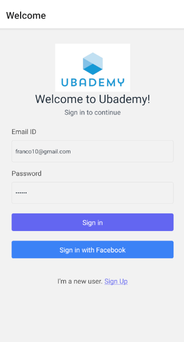
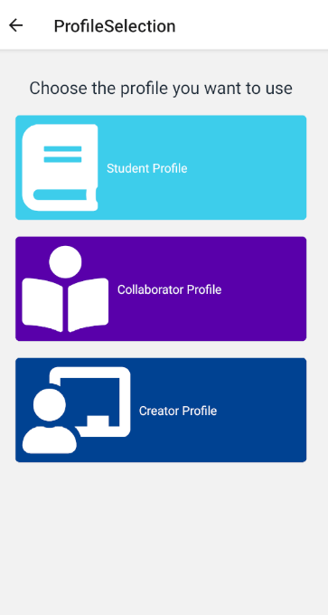
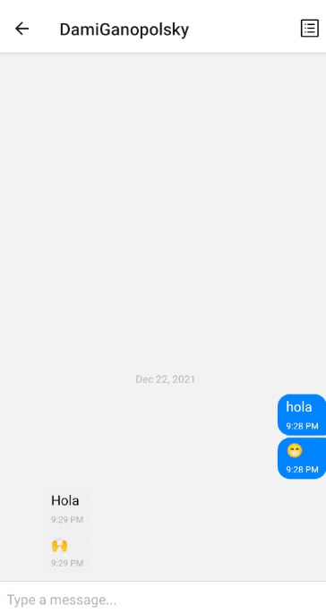
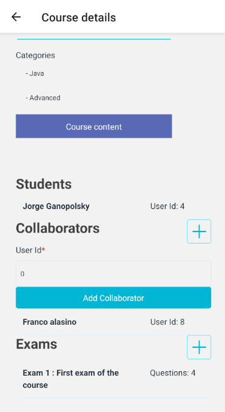

# App-Mobile

## Screenshots












### Requirements

Last versions of Node, npm and yarn installed

### Install all dependencies 

yarn install


#### In order to fix some warnings:

WARNING: After installing all dependencies you must modify  the node_modules/react-native-selectmultiple-button/libraries/SelectMultipleButton.js file
You must replace constructor and componentDidMount functions and replace componentWillReceiveProps for getDerivedStateFromProps
```   
 constructor(props) {
    super(props)
    this.state = {
      selected: false,
      lastPropsSelected: null,
    }
  }

  componentDidMount() {
    this.setState({
      selected: this.props.selected,
    })
  }

  /*
  componentWillReceiveProps(nextProps) {
    if (this.props.selected !== nextProps.selected) {
      this.setState({
        selected: nextProps.selected
      })
    }
  }
    */

  static getDerivedStateFromProps(props, state) {
    if (props.selected !== state.lastPropsSelected) {
      return {
        selected: props.selected > state.lastPropsSelected,
        lastPropsSelected: props.selected,
      };
    }

    // Return null to indicate no change to state.
    return null;
  }
 ```

WARNING: Setting a timer for a long period of time, i.e. multiple minutes, is a performance and correctness issue on Android as it keeps the timer module awake, and timers can only be called when the app is in the foreground.

Fix:
To fix this issue...

    Navigate to your node_modules/react-native/Libraries/Core/Timers/JSTimers.js file.

    Look for the variable MAX_TIMER_DURATION_MS

    Change its value to 10000 * 1000

    Save the changes (with auto format turned off) and re-build your app.

